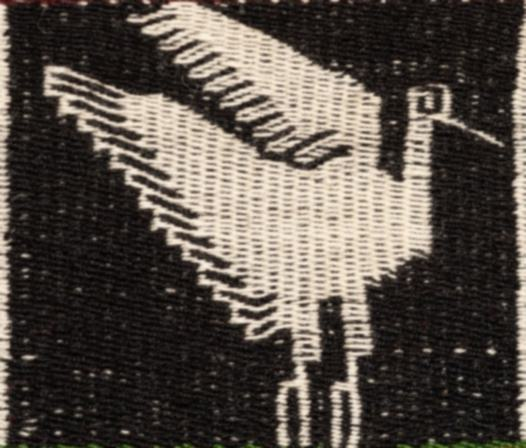

### Dépôt pour la recherche de master 1 en [Humanités Numériques](https://www.chartes.psl.eu/).
# La compréhension des motifs tissés dans les Andes : une approche par la détection automatique

Ce projet porte sur la détection de motifs dans des textiles andins grâce à l'apprentissage supervisé.

# Contenu du dépôt
- `Scripts/` : le dossier contient les scripts en .py et en .ipynb pour les différentes étapes de pré-traitement, ainsi que le notebook pour l'implémentation de Detectron (version adaptée à Google Colab).
- `images_rescaled/` : le dossier contient les images redimensionnée (voir le script `rescaleImages.py`).
- `rendu/` contient :
   - `source/` : le dossier contant le code source LaTex pour la rédaction du mini-mémmoire.
   - Le mini-mémoire de master 1 au format PDF.
- `annotations/` : le dossier contient les annotations en COCO json réalisées sur le site [_VGG Image Annotator_](https://www.robots.ox.ac.uk/~vgg/software/via/via.html).
- `model_manta.xlsx` : le fichier Excel contenant une modélisation de la manta.

### Auteure
Ce projet a été réalisé par :
- Lise Bernard

### Licence
L'entièreté des documents présent dans ce _repository_ sont sous licence CC BY-NC-SA.
